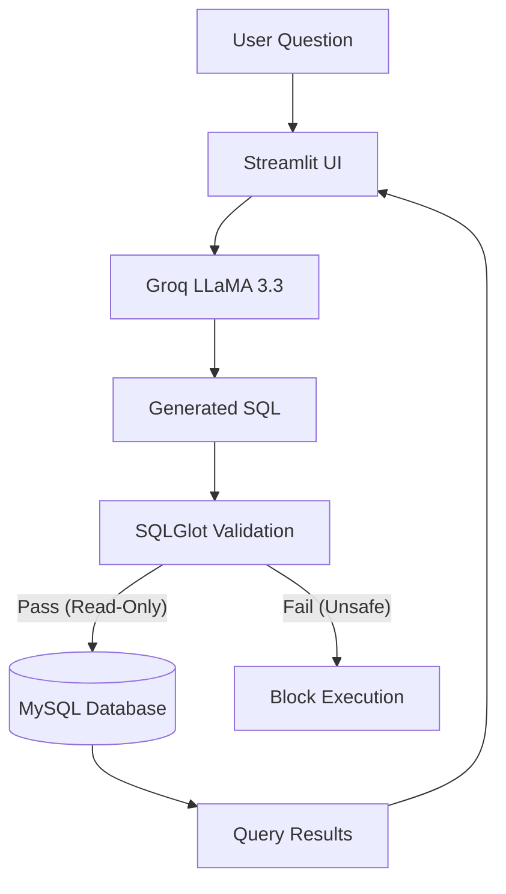

# 🧠 Chat with MySQL (Text-to-SQL)

A production-grade **Text-to-SQL** application that allows you to chat with your MySQL database using natural language. Built with **LangChain (LCEL)**, **Groq LLaMA 3.3**, and **Streamlit**, it ensures safe, read-only database interactions with dynamic result visualization.


## ✨ Features

- **Natural Language to SQL**: Converts questions like _"Show top 5 customers by credit limit"_ into valid SQL.
- **🛡️ Secure Execution**:
  - **Read-Only Enforcement**: Blocks `INSERT`, `UPDATE`, `DELETE`, `DROP`, etc., using **SQLGlot** AST validation.
  - **Automatic Limits**: Automatically appends `LIMIT 100` if not specified to prevent oversized queries.
- **⚡ High Performance**: Uses **Groq's LLaMA 3.3 70B** for lightning-fast SQL generation.
- **Dynamic Visualization**:
  - Results are rendered as interactive **Pandas DataFrames** in Streamlit.
  - Schema is fetched dynamically; no hardcoded columns.
- **Conversation Memory**: Maintains context for follow-up questions.
- **Dual Modes**: Run as a **Web App** (Streamlit) or a **Script** (`main.py`).

## 🧱 Architecture



## 🛠️ Tech Stack

- **LLM**: Groq (LLaMA 3.3 70B Versatile)
- **Orchestration**: LangChain (LCEL)
- **Validation**: SQLGlot (AST Parsing)
- **Database**: MySQL (via `pymysql` & `SQLAlchemy`)
- **Frontend**: Streamlit
- **Configuration**: `python-dotenv`

## 📂 Project Structure

```bash
multi_pdf_chatbot/  # (Folder name may vary)
├── app.py          # 🚀 Main Streamlit Web Application
├── main.py         # 🧪 CLI/Script version for quick testing
├── requirements.txt # 📦 Python dependencies
├── .env            # 🔑 Environment variables (API Keys, DB Config)
└── README.md       # 📄 This detailed documentation
```

## ⚙️ Installation

### 1. Clone the Repository

```bash
git clone <repository-url>
cd <repository-folder>
```

### 2. Set Up Virtual Environment

Using [uv](https://github.com/astral-sh/uv) (recommended) or `venv`:

**Using uv:**

```bash
uv venv
source .venv/bin/activate  # On Windows: .venv\Scripts\activate
uv pip install -r requirements.txt
```

**Using standard pip:**

```bash
python -m venv venv
source venv/bin/activate   # On Windows: venv\Scripts\activate
pip install -r requirements.txt
```

### 3. Configure Environment Variables

Create a `.env` file in the root directory:

```ini
# Database Configuration
DB_HOST=localhost
DB_PORT=3306
DB_USER=root
DB_PASSWORD=your_password
DB_NAME=your_database

# API Keys
GROQ_API_KEY=gsk_...
```

## 🚀 Usage

### Option A: Run the Web App (Streamlit)

This launches the interactive chat interface.

```bash
streamlit run app.py
```

_Open [http://localhost:8501](http://localhost:8501) in your browser._

### Option B: Run the Script

Good for testing the chain without UI.

```bash
python main.py
```

## 💡 Example Prompts

Try asking questions like:

- _"List all employees in the Sales department."_
- _"Show me the top 5 most expensive products."_
- _"What is the total revenue for 2024?"_
- _"Who are the customers with a credit limit over 50000?"_

## 🛡️ Security Details

This project uses **SQLGlot** to parse the generated SQL into an Abstract Syntax Tree (AST) before execution.

- **Allowed**: `SELECT`
- **Blocked**: `INSERT`, `UPDATE`, `DELETE`, `DROP`, `ALTER`, `CREATE`
- **Safety**: If the LLM generates a malicious query (e.g., `DROP TABLE users`), the validator will detect the `Drop` expression node and block execution immediately.

## 🤝 Contributing

Contributions are welcome! Please open an issue or submit a pull request for any improvements.
